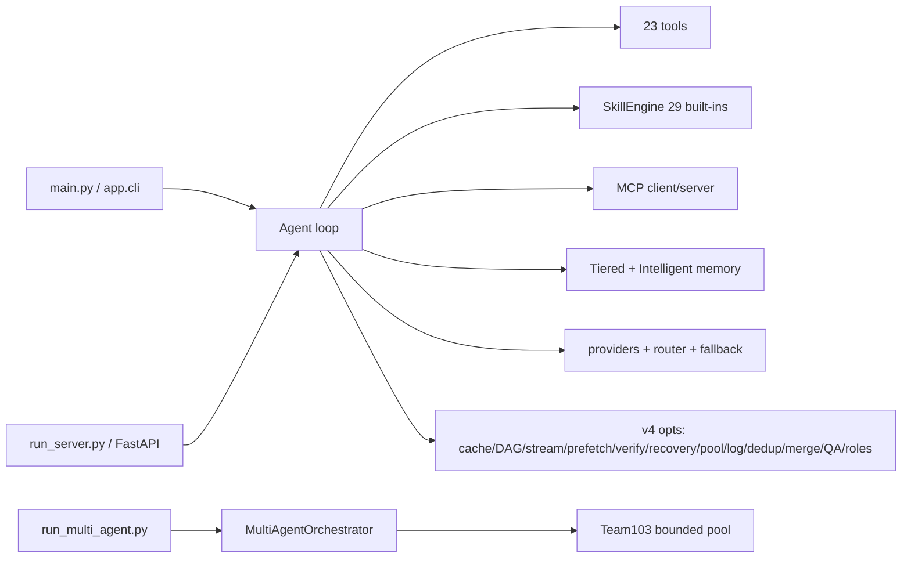

# ARCHITECTURE — SHS-Code v4.0.0 (verified source)

## High-level

## Single-agent
`app/cli.py` (slash dispatch) → `app/agent/` (base, roles, toolcall, orchestrator triage)
→ `app/llm/` (message build, streaming, fallback, rate_limiter, credential_pool)
→ tools → `verify` → memory/session persist.

## Autonomous loop
Bounded (`max_steps/max_iterations`), stuck detection, confirm_risky gate,
checkpoints, `--continue` resume, stale-session recovery on server boot.

## Multi-agent
`MultiAgentOrchestrator`: triage simple/small/complex; complex = PM→Architect→Engineer→QA
serially via events; each role full LLM loop (4x amplification).

## 103-agent team
`app/team103/scheduler.py`: PM `decompose_goal` → Architect `_waves` → Engineers
(bounded coroutines, AIMD 8→100, file locks, timeout/retry/checkpoint, gather = work-stealing,
`merge_results`) → QA (`cont_qa.py` + `risk_verify.py`). NOT 103 LLM loops.

## Memory
L1 LRU(512) → L2 dict+SQLite batched → Markdown sidecar; short/long-term; intelligent
(classify + relevance/recency/reliability + contradictions); sessions SQLite.

## Tools / Skills / MCP / Providers
Tools: `app/tool/*.py` 23 classes + `MCPProxyTool` dynamic. Skills: `SkillEngine`,
`builtin/*.md` + user dir + installed/ + state json. MCP: `app/mcp/client.py|server.py`
(stdio/SSE). Providers: `app/config.py [llm]` + `app/providers.py` registry +
`app/llm/*` + `app/v4/model_router.py`.

## Task DAG / Worker pool / Verification / Context / Browser / Git
DAG: `app/v4/async_dag.py` (`run_dag`, `run_parallel` limit 16) + `task_dag` tool.
Pool: Team103 AIMD + semaphore. Verification: `verify` tool + `risk_verify.py` tiers +
`cont_qa.py`. Context: `[context]` rolling condenser + `context_mgmt.summarize_output`.
Browser: `browser_use` tool + `app/v4/browser_pool.py` bounded pool + sweeper.
Git: `git_intel.py` + `app/git_providers/` (github/gitlab/bitbucket/azure_devops/forgejo).
