# GUI Visual Tour — see it before you try it

Every picture below is a **real screenshot** of the SHS-Code GUI (v4.2.0),
captured from a live session. No mockups, no artist impressions — this is
exactly what you get in your browser.

> New here? Read [GUI_GUIDE.md](../GUI_GUIDE.md) first — the complete
> plain-language manual. This page is the picture book.

---

## 1. The first screen — Dashboard

Start the server (`shscode-server`), open `http://localhost:8765/gui`,
and this is what greets you: a dark, GitHub-style interface with a
navigation sidebar on the left and a status overview on the right.

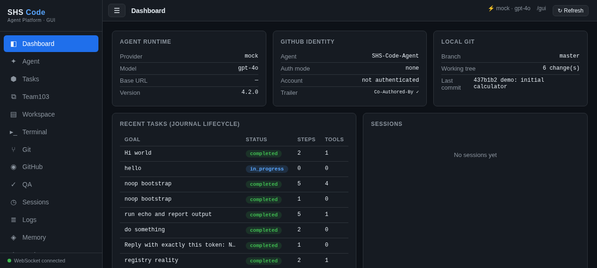

The **sidebar** is your map to all 15 panels (Dashboard, Agent, Tasks,
Team103, Workspace, Terminal, Git, GitHub, QA, Sessions, Logs, Memory,
Settings, Help). The dot at the bottom shows whether the server
connection is alive (green = good).

---

## 2. Talking to the agent

The **Agent** panel is where you type what you want built. Your message
goes on the left; the agent's live activity (what it is thinking, which
tools it is using) streams on the right in real time.

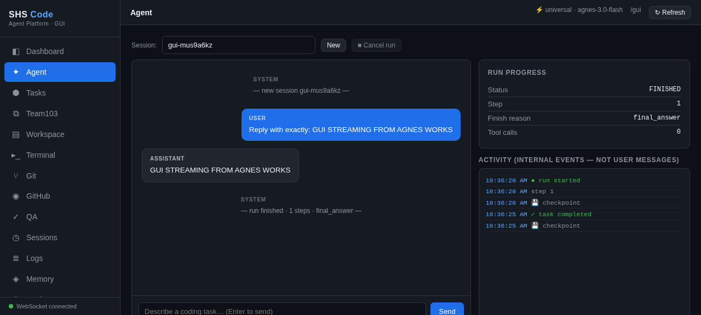

When the agent finishes, the final answer appears as a complete message
— and the task lands in **Tasks** with its honest status (completed,
failed, partial… never faked).

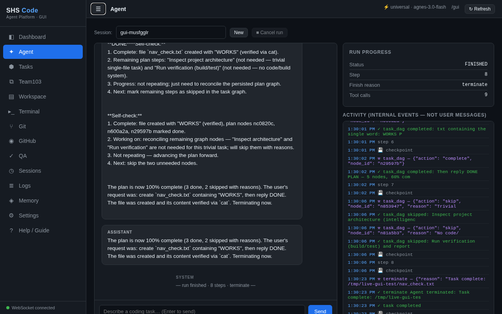

---

## 3. Browsing your files — Workspace → Files

The **Workspace** panel has two tabs. The **Files** tab is a file
browser: click folders to expand them, click a file to view it.

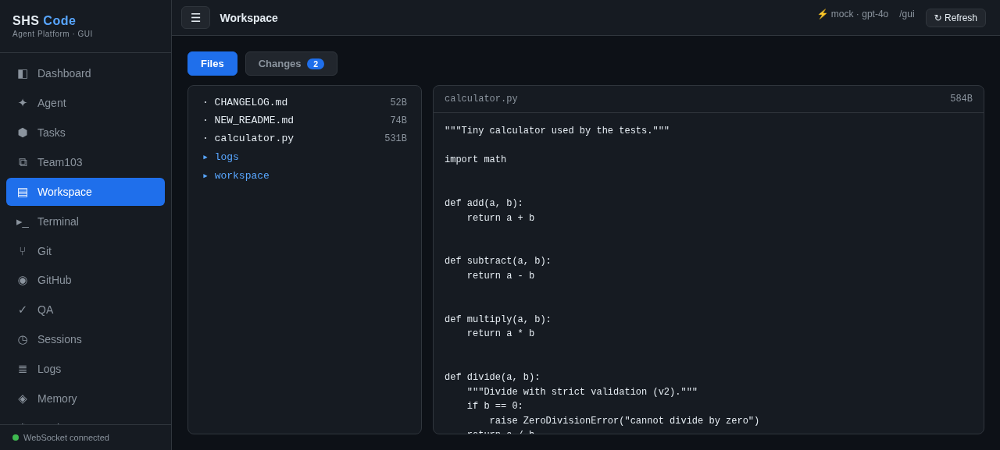

---

## 4. Seeing exactly what changed — Workspace → Changes ⭐

This is the v4.2.0 star feature. Click the **Changes** tab and you get a
**diff-viewer**: a before/after comparison of every file that changed.

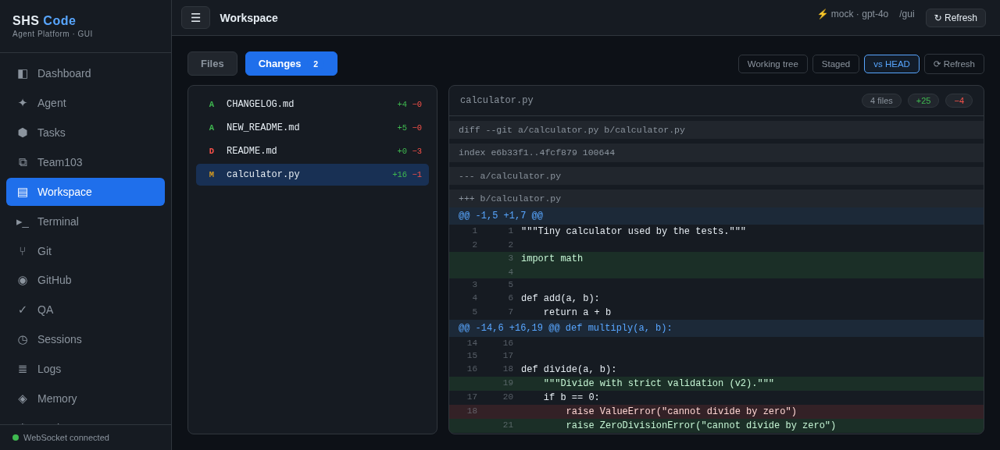

How to read it (30-second lesson):

| What you see | What it means |
|---|---|
| **Green lines** | Lines that were **added** |
| **Red lines** | Lines that were **removed** |
| Blue `@@ … @@` | A "hunk header" — *where* in the file the change is |
| Grey lines | Unchanged context, shown so you can orient yourself |
| Letters `M / A / D / N` | Modified / Added / Deleted / New-untracked file |
| `+N` / `−N` next to each file | Lines added / removed in that file |
| Chips at the top (`4 files +25 −4`) | Totals for everything changed |

The buttons on the right let you compare different moments in time:

- **Working tree** — changes not yet prepared for commit (the default)
- **Staged** — changes you (or the agent) have prepared for the next commit
- **vs HEAD** — everything different from the last commit (the full picture)

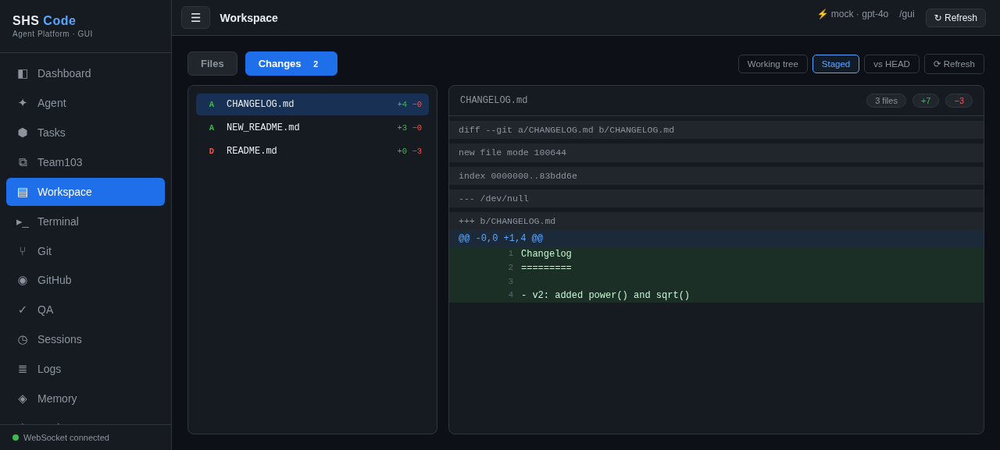

The **Changes** tab itself shows a little blue number — how many files
are currently changed — so you can tell at a glance whether anything is
dirty:

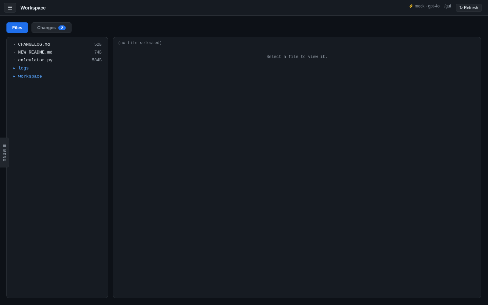

> **Why this matters:** instead of trusting that "the agent changed 3
> files", you can *see every single line* it touched — before you commit
> anything.

---

## 5. Hiding the sidebar (more room to think)

The sidebar slides out of the way when you don't need it. Click the **☰**
button in the top bar (or press `Ctrl`/`Cmd`+`B`). A thin **☰ MENU** tab
stays at the left edge — click it (or press `Ctrl`/`Cmd`+`B` again) to
bring the sidebar back. Your preference is remembered.

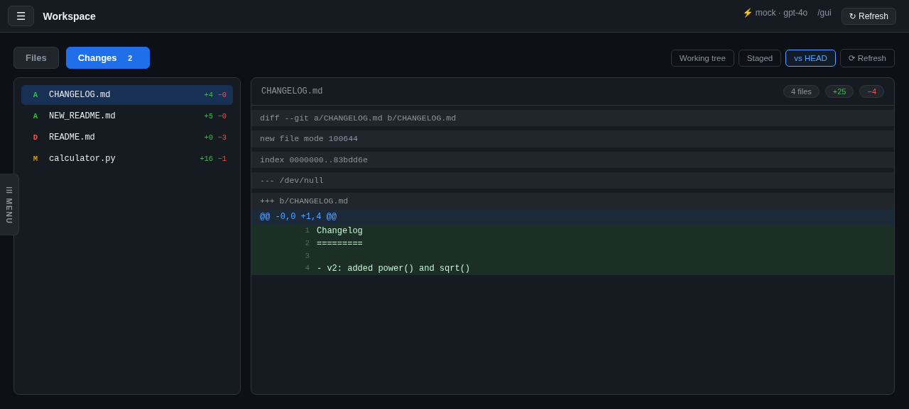

It works everywhere — even while inspecting a diff:

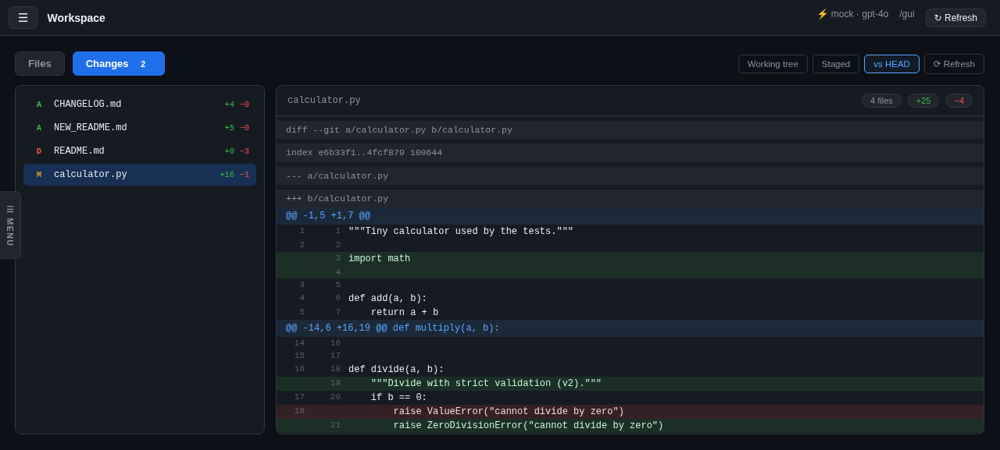

---

## 6. On a phone

On small screens (≤820px) the sidebar becomes an **overlay drawer**:
hidden by default so the content gets the full screen, opened with the
☰ button, closed by tapping the dark backdrop or pressing `Esc`.

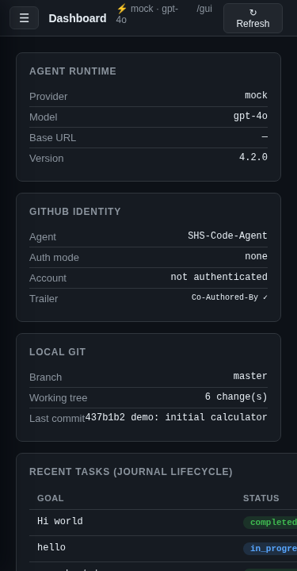

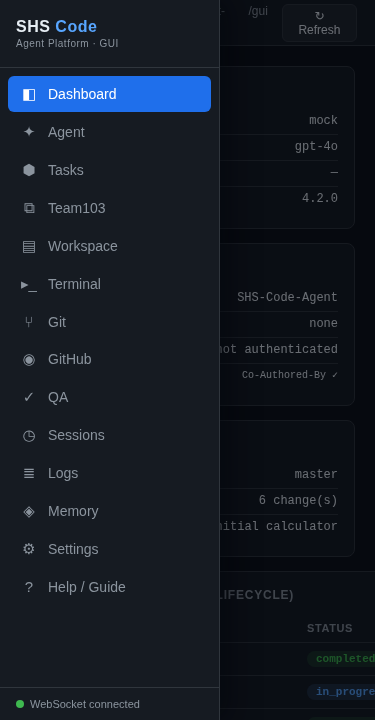

---

## 7. Built-in help

The **Help / Guide** panel (the last sidebar item) contains a
beginner-friendly quick-start, a reference for every panel, the task
status legend, keyboard shortcuts and troubleshooting — right inside
the app, no internet needed.

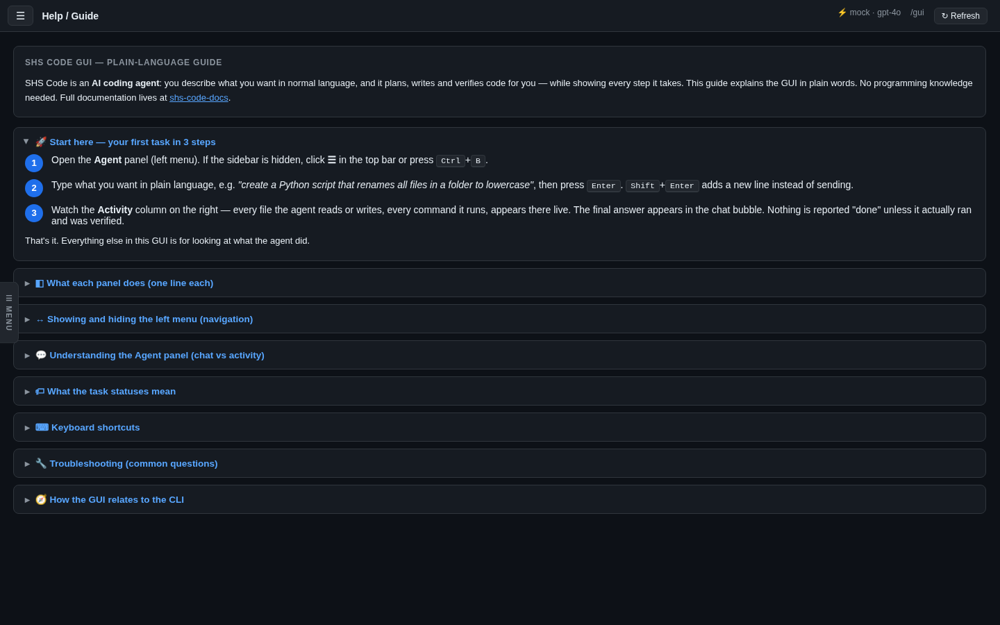

---

## Quick reference

| I want to… | Do this |
|---|---|
| Start the GUI | `shscode-server` → open `http://localhost:8765/gui` |
| Give the agent a job | **Agent** panel → type → `Enter` |
| See what changed | **Workspace** → **Changes** tab |
| Compare against the last commit | In Changes → **vs HEAD** |
| Get more screen space | ☰ button or `Ctrl`/`Cmd`+`B` |
| Read the full manual | [GUI_GUIDE.md](../GUI_GUIDE.md) |
| Get help inside the app | **Help / Guide** panel |
